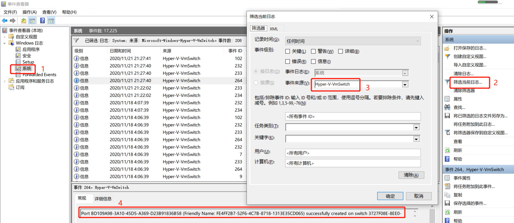
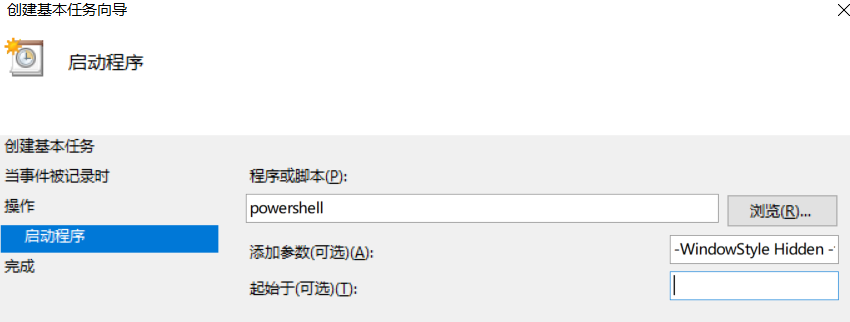

# wsl

## wsl2获取宿主机IP

```sh
$ ip route | grep default | awk '{print $3}'
```

## wsl2动态IP

> 参考资料：https://lengthmin.me/posts/wsl2-network-tricks/

+ WSL2 使用的网络适配器是 ‘Default Hyper-V Switch’，这个适配器每次重启都会被删除重建，这就是 WSL2 为什么 IP 不固定的原因。

+ 使用`PowerShell`脚本每次ip变化时自动写到`hosts`文件中，宿主机使用域名访问`wsl2`

+ 步骤

  + 编写脚本`wsl2.ps1`

    ```powershell
    # [Config]
    $wsl_hosts = "wsl.local"
    $win_hosts = "win.local"
    $HOSTS_PATH = "$env:windir\System32\drivers\etc\hosts"
    
    # [Start]
    $winip =(-Split (bash.exe -c "ip route | grep default"))[2]
    $wslip = (bash.exe -c "hostname -I | awk '{print $1}'")
    $found1 = $winip -match '\d{1,3}\.\d{1,3}\.\d{1,3}\.\d{1,3}';
    $found2 = $wslip -match '\d{1,3}\.\d{1,3}\.\d{1,3}\.\d{1,3}';
    
    if( !($found1 -and $found2) ){
      echo "The Script Exited, the ip address of WSL 2 cannot be found";
      exit;
    }
    
    # [Ports]
    # control whether forward port from windows to wsl
    $redirect_port = $FALSE
    
    if ($redirect_port) {
      # All the ports you want to forward separated by coma
      $ports=@(80,443,8080);
    
      # [Static ip]
      # You can change the addr to your ip config to listen to a specific address
      $addr='0.0.0.0';
      $ports_a = $ports -join ",";
    
      # Remove Firewall Exception Rules
      iex "Remove-NetFireWallRule -DisplayName 'WSL 2 Firewall Unlock' " | Out-Null
    
      # Adding Exception Rules for inbound and outbound Rules
      iex "New-NetFireWallRule -DisplayName 'WSL 2 Firewall Unlock' -Direction Outbound -LocalPort $ports_a -Action Allow -Protocol TCP"  | Out-Null
      iex "New-NetFireWallRule -DisplayName 'WSL 2 Firewall Unlock' -Direction Inbound -LocalPort $ports_a -Action Allow -Protocol TCP"  | Out-Null
    
      for( $i = 0; $i -lt $ports.length; $i++ ){
        $port = $ports[$i];
        iex "netsh interface portproxy delete v4tov4 listenport=$port listenaddress=$addr"  | Out-Null
        iex "netsh interface portproxy add v4tov4 listenport=$port listenaddress=$addr connectport=$port connectaddress=$wslip"  | Out-Null
      }
    }
    
    # [Hosts]
    # Get hosts file Content
    $HOSTS_CONTENT = (Get-Content -Path $HOSTS_PATH) | ? {$_.trim() -ne "" } | Select-String -Pattern '# w(sl)|(in)_hosts' -NotMatch
    # add custom hosts into hosts content
    $HOSTS_CONTENT = $HOSTS_CONTENT + "`n$wslip $wsl_hosts # wsl_hosts`n$winip $win_hosts # win_hosts"
    # write file
    Out-File -FilePath $HOSTS_PATH -InputObject $HOSTS_CONTENT -Encoding ASCII
    
    ipconfig /flushdns | Out-Null
    ```

  + `事件查看器` >> `Windows日志` >> `系统` >> `筛选当前日志` >> 事件来源选择`Hyper-V-VmSwith` >> 筛选结果中找出类似如下内容的事件

    ```
    Port BD109A98-3A10-45D5-A369-D23B91836B58 (Friendly Name: FE4FF2B7-52F6-4C7B-8718-1313E35CD065) successfully created on switch 3727F08E-8EE0-4EF2-845A-EBDC7046857F (Friendly Name: WSL).
    ```

     

  + 右键单击该事件 >> `将任务附加到该事件` >> 为任务起名，下一步，下一步 

    ->> `操作`中选择`启动程序`

    `程序或脚本`填`powershell`

    `添加参数`填`-WindowStyle Hidden -file E:\github\wsl\wsl2-host.ps1`

     

  + 取消`hosts`文件只读属性

  + 设置系统允许运行自定义`powershell`脚本

    以管理员身份在`powershell`命令行运行

    ```powershell
    # 设置一次就永久有效了
    set-executionpolicy remotesigned
    ```

+ 配置完成后，每次`wsl2`网络适配器变更都会运行该脚本，修改`hosts`文件，`wsl2`内`hosts`文件也会对应修改

  windows通过`wsl.local`可以访问`wsl2`

  `wsl2`通过`win.local`可以访问windows

## 局域网访问WSL2

[wsl2动态IP](wsl2动态IP)脚本中`redirect_port`变量值改为`TRUE`（19行），`ports`变量中加入要转发的端口（23行），运行脚本，即可实现端口转发，局域网访问wsl2